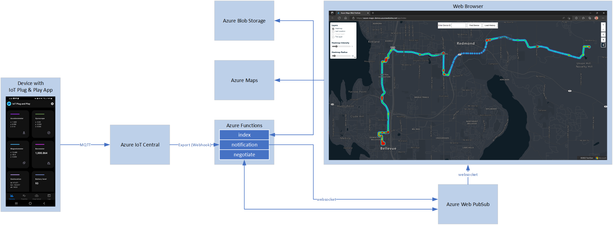

# Indoor realtime position tracking using LoRaWAN devices and Azure Maps

The purpose of this project is to ilustrate how we implemented realtime position tracking for the LoRaWAN World Expo 2022 in Paris using Actility's Abeeway LoRaWAN trackers, Azure PubSub, Azure IoT Central, and Azure Maps. This is a simple implementation of an image overlay of the venue (Palace of Congress in Paris) on top of a map, leveraging indoor beacons located in the venue to enable the trackers to provide accurate indoor positioning using Actility's Location Services.

## Available Implementations

This project consists of two main demo implementations:

* LoRaWAN World Expo demo (based on a real deployment made for this conference in July of 2022), which is located in [this folder](src\realtime-azuremaps-update-lwe).
* IoT Central plug and play demo (using the IoT Central plug and play smartphone application as the device providing tracking information and a general public venue as an example of an overlay image), which is located in [this folder](src\realtime-azuremaps-update-iotcentraldemo).

## General Architecture

Here is the general architecture for this solution:

Main components:

* Tracking device. For the IoT Central demo, we used the Plug and Play application available [here](https://docs.microsoft.com/en-us/azure/iot-fundamentals/iot-phone-app-how-to), which leverages your smartphone as the tracking device to get you started quickly and easily. For the LoRaWAN World Expo demo, we used real LoRaWAN tracking devices from Abeeway (details available [here](https://www.abeeway.com/smart-badge/)). In the case of LoRaWAN, the data coming from the devices first goes to a LoRaWAN gateway that then pushes the data to the LoRaWAN Network Server, which is the component that's integrated with Azure (for both IoT Hub and IoT Central). For simplicity, this design is using Actility's IoT Central connector. These details are not represented in the above diagram but are easy to understand.
* Azure IoT Central. Device management plane. Data coming from devices surfaces here and we use Continuous Data Export to filter and push data to the Azure Functions that get triggered every time a new message arrives from a device.
* Azure Functions. These functions get triggered every time a new device message is received in IoT Central. There are 3 main functions: index, notification, and negotiate. The "index" funcion implements the web application that displays the map and the real time location data. The "negotiate" function is the one responsible for doing the handshake between the browser and the Azure Web PubSub service to establish a web sockets communication channel. And finally the "notification" function is the one responsible for handling all the location messages coming from the devices and passing the data along to the correspoding clients (browser, storage).
* Azure Blob Storage. Used for persisting data for historical analysis and for saving general used libraries and files required by Azure Maps.
* Azure Maps. For visualizing location data.
* Azure Web PubSub. For establishinb a web sockets communication channel between a publisher and a subscriber.
* Web Browser. Client application for visualizing location data.

## Getting Started

### Prerequisites

- Azure Subscription
- Azure IoT Central Account
- [Visual Studio Code](https://code.visualstudio.com/) with extension(s) - Azure Functions
- Node.js
- [Azure Function Core Tools](https://github.com/Azure/azure-functions-core-tools#installing)
- [Azure CLI](https://docs.microsoft.com/en-us/cli/azure/)
- [Postman](https://www.postman.com/downloads/)
- [Azure Storage Explorer](https://azure.microsoft.com/en-us/features/storage-explorer/)
- Optional to develop apps for data capturing and replaying (i.e., Visual Studio Community Edition, an IDE to develop for your mobile device, e.g., Android Studio)
- [QGIS](https://qgis.org/en/site/), for creating map tiles

### Installation

Please, follow instructions described [here](docs/Azure-Maps-IoT-Central-Demo.pptx).

## Resources

Any additional resources and related projects:

- [Quickstart - Use your smartphone as a device to send telemetry to an IoT Central application](https://docs.microsoft.com/en-us/azure/iot-central/core/quick-deploy-iot-central)
- [Tutorial: Create a serverless notification app with Azure Functions and Azure Web PubSub service](https://docs.microsoft.com/en-us/azure/azure-web-pubsub/tutorial-serverless-notification?tabs=javascript)
- [Azure Maps Samples](https://samples.azuremaps.com/)
- [Location and Maps in Azure IoT Central powered by Azure Maps](https://azure.microsoft.com/en-us/blog/location-and-maps-in-azure-iot-central-powered-by-azure-maps/)